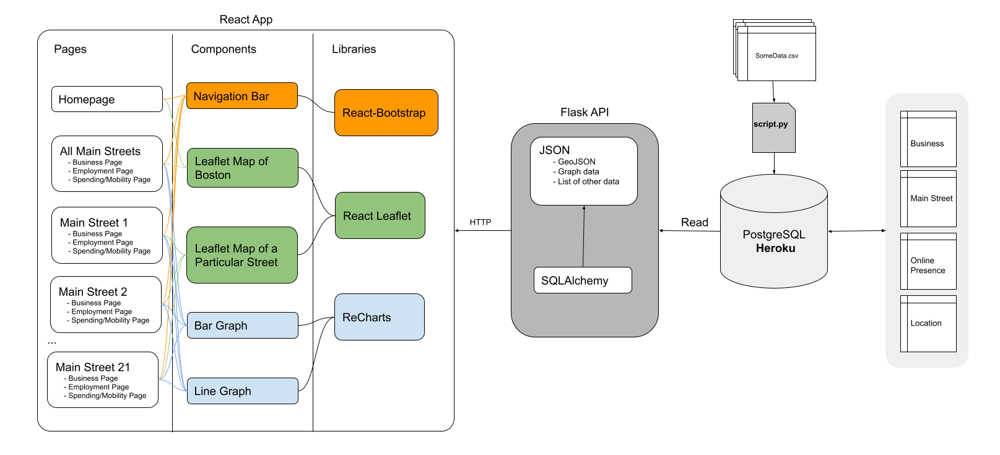
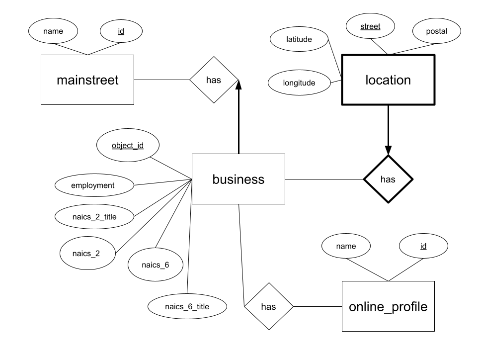

# Boston Main Street District Viewer

Boston Main Street District Viewer is a project from the BPDA Research Division and Boston University Spark. This interactive map combines public data and anonymized data from private companies to visualize the characteristics of Boston Main Street Districts and the impact of COVID-19 pandemic on the economic prospects of businesses and people in each district.

This is part of a broader initiative to understand the current environment in Boston. More research produced by the Boston Planning and Development Agency can be found on the BPDA Research Website: www.bostonplans.org/research

**Important Note**: At the moment there is only complete data for the main street Washington Gateway. The other main streets (Brighton, Chinatown, Four Corners, Allston Village) only have business data. Until more data is added, more main streets can be added.

## Technical Architecture 

Frontend: 
 - React App

Backend:
 - Python Flask

Database:
 - Postgres
 - Hosted by Heroku

Diagram:

## Relational Database

This was built based on data given in backend/data/MainStreets_Business_List.csv

In backend/data/csv_to_db.py, the tables are created and then populated.

**Important Note**: This database cannot be worked on anymore due to the limitations of a free Heroku account. This database is only temporary and is now used to display the current data within the tables. If future work is needed, such as adding features to the table, I recommend creating a new database and using the script provided (csv_to_db.py).

Diagram:

## Flask API and React App Deployment

Clone the repository first

`git clone https://github.com/BU-Spark/se-bpda-main-streets.git`

### Run Flask API Locally

Enter backend directory

`cd backend`

Download requirements from requirements.txt

`pip install -r requirements.txt`

Commands are also located in /backend/launch.sh

`cd api`

For Linux System: 
`export FLASK_APP="app:create_app('default')"`

For Windows Powershell:
`$env:FLASK_APP = "app:create_app('default')"`

`flask run`

### Deployment of Flask API

The current Flask API is deployed here on an Amazon EC2 virtual machine (VM): [Deployed FLASK API](https://se-bpda.buspark.io/)

If you would like to deploy this Flask API on a VM and use a different domain, here are the steps:

When editing a file, I use Vim. The basic commands for Vim are:
- Press "i" to edit
- ESC when done editing 
- ":x" to save and quit
- "q!" to quit without saving

Prerequisites:
- Create a domain name
- Ensure Python 3 is installed

Installments:
- Install virtual environment: `sudo apt install python3-venv`
- Install Nginx: `sudo apt install nginx`

Clone the repository

`git clone https://github.com/BU-Spark/se-bpda-main-streets.git`

Create a virtual environment to run the Gunicorn service easily. This will be created in the same directory as app.py (backend/api/app.py) which runs the Flask API for easy access.

`source se-bpda-main-streets/backend/api/bpda/bin/activate`

Install needed dependencies in the virtual environment. Can install the dependencies from requirements.txt or run these commands:

`pip install wheel`

`pip3 install pandas`

`pip3 install numpy`

`pip3 install psycopg2`

`pip3 install geojson`

`pip3 install sqlalchemy`

`pip3 install gunicorn flask`

Now you are complete with the virtual environment, so deactivate it

`deactivate`

Create and edit a unit file ending in .service within the /etc/systemd/system directory:

`sudo vim /etc/systemd/system/bpda.service`

Paste this into the file. Note that the working directory may differ depending on your machine.

    [Unit]
    Description=Gunicorn instance to run BPDA Flask API deployment
    After=network.target

    [Service] 
    User=ubuntu
    Group=www-data
    WorkingDirectory=/home/ubuntu/se-bpda-main-streets/backend/api
    Environment="PATH=/home/ubuntu/se-bpda-main-streets/backend/api/bpda/bin"
    ExecStart=/home/ubuntu/se-bpda-main-streets/backend/api/bpda/bin/gunicorn --workers 3 --preload --bind unix:bpda.sock -m 007 app:"create_app('default')"

    [Install]
    WantedBy=multi-user.target

Now start the Gunicorn service of Flask API

`sudo systemctl start bpda`

You can check the status of the project with this code. Ensure the service is active and running

`sudo systemctl start bpda`

Configure Nginx to proxy requests; create a server block configuration file in Nginx's directory

`sudo nano /etc/nginx/sites-available/bpda`

Paste this into the file, change the domain with the domain you created:

    server {
    listen 80;
    server_name DOMAIN;

    location / {
        include proxy_params;
        proxy_pass http://unix:/home/ubuntu/se-bpda-main-streets/backend/api/bpda.sock;
    }
}

Link the file to Nginx's sites-enabled directory

`sudo ln -s /etc/nginx/sites-available/bpda /etc/nginx/sites-enabled`

Restart Nginx

`sudo systemctl restart nginx`

Allow full access to Nginx server

`sudo ufw allow 'Nginx Full'`

Secure the application with Certbot; install Certbot and create a symbolic link

`sudo snap install --classic certbot`

`sudo ln -s /snap/bin/certbot /usr/bin/certbot`

Certbot will generate the certificate with this command. Once this command is entered, Certbot will create a prompt that may ask you for your email or some other information; fill them out as needed. Finally, Certbot will prompt a decision to make the server run on HTTPS; say yes. Make sure to replace DOMAIN with the new domain that you created

`sudo certbot --nginx -d DOMAIN`

The server is deployed! Check https://DOMAIN to see Flask API. Now you can use this domain and connect it to the React App. Make sure to change the URL in the React App if you are using a new domain

### Deployment of React App Locally

Enter frontend directory

`cd frontend/dev-app/`

Download requirements

`npm install`

Deploy

`npm start`

If react scripts are needed (an error arises when deploying for react scripts)

`npm install react-scripts --save`

### Deploy React App to Github Pages

Enter frontend directory

`cd frontend/dev-app/`

Deploy to [BPDA Page](https://bu-spark.github.io/se-bpda-main-streets/)

`npm run deploy`

## Bugs & Errors

The way pages are created in frontend/dev-app/App.js: [Issue Link](https://github.com/BU-Spark/se-bpda-main-streets/issues/6)

Empty pages being rendered with a message stating "No data": [Issue Link](https://github.com/BU-Spark/se-bpda-main-streets/issues/5)

Homepage Boston interactive map: [Issue Link](https://github.com/BU-Spark/se-bpda-main-streets/issues/7)

## Future Implementations

Improve the way pages are created
- In frontend/dev-app/src/App.js the various routes/pages are created in a repetitive manner with different data
- A possible improvement is through moving this data to Flask API and sending it to App.js. 
- Benefits: cleans the repetitiveness of App.js
- Problems: slower due to the fetching of Flask API 

Search bar
- This will allow users to search main streets or specific businesses
- If the main street is searched for, then the web app would redirect to the business tab of that main street
- If a business is searched for, then the web app would redirect to the main street page of where this business is located. If this business is present in multiple main streets, then all main streets could be listed out under the search tab

User authentication/administration
- This would include the creation of a sign-up page, a login page, a request data change page, and a make changes page
- Different users would have different administration accesses; BPDA could have admin, main street business managers could make requests to the website without being able to make any changes, and users without any connection to this information would have no administration rights
- This would involve a user authentication of the various administrated users such as BPDA employees and main street business managers
- The goal of this addition would allow BPDA to have the most up-to-date data on the various Boston main streets. If a main street business manager wants to update, add, or delete their business to this web app, they can log in to their account and make a request using the request page to add this new data. For BPDA employees, they can log in and see that requests are being made and can make a final decision on what to do with these requests, such as add the data to their database or remove it.

Improved database
- This is currently being developed by a team at BPDA
- With the creation of a more complete database containing all desired data, this web application can have more information for its users to view

